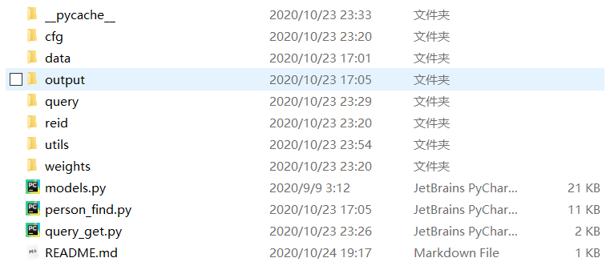
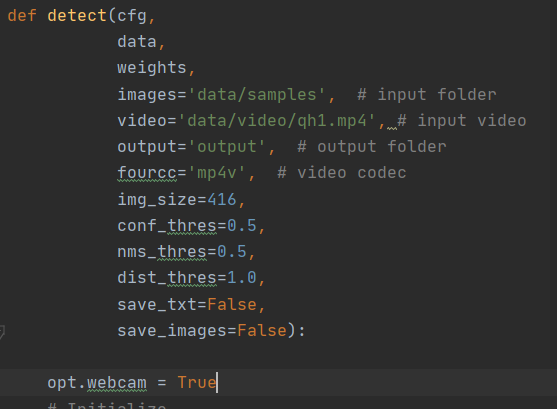
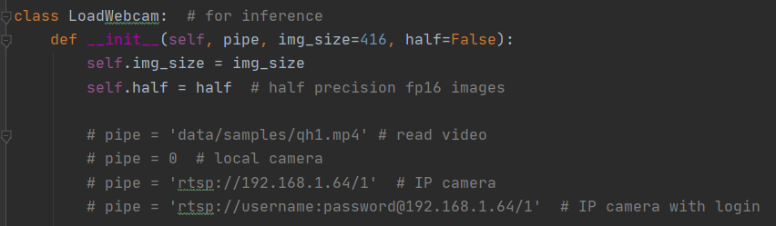

# YOLOv3+行人重识别 实现特定行人检索

### 运行环境

1. Python 3.7.6  

2. Pytorch 1.5.0+cu101（后一个为cuda版本）不一定要一样，但建议pytorch版本1.4及以上

pytorch安装时需要安装带cuda版本的，cuda可能需要单独先安装，win下很简单，注意版本对应即可。   

### 文件说明

- cfg文件夹中存放yolov3的配置参数
- data文件夹中是待检测的照片或视频，视频存放在video文件夹中，照片存在samples中
- output文件夹可以存储输出的结果图
- query文件夹中是要搜索的行人库，库中样本多了运行会变慢，照片命名格式与market1501保持一致
- reid中是行人重识别网络(resnet)的模型，配置参数和数据处理等函数
- utils也是一些处理数据的工具。
- weights中是训练好的权重。719rank1是resnet的，其他都是yolo的。yolov3 用的是提供的COCO权重。重识别用的是网上下的Market1501数据集、CUHK03数据集和MSMT17数据集进行了联合训练的权重。
- model.py是yolo的网络模型。
- person_find.py是程序总入口。
- query_get.py用来截取需要重识别的行人库样本。

### 使用方法

1. 准备含有目标行人的视频，运行query_get.py（可能需要修改一下路径），按住回车可以播放视频，拖动鼠标截取目标行人，会自动将照片保存在query文件夹中。如果要从照片中导入，可能要稍微修改一下程序，不难。

2. 准备待测图片或视频放在data文件夹中。修改person_find.py中的参数，或者直接使用命令行运行脚本，命令后追加指定参数（具体看看代码）。

   

   可能需要修改视频名，使用视频opt.webcam为true。当然也可以使用摄像头和网络摄像头，查看utils/datasets.py里的LoadWebcam函数：

   

   如果要使用摄像头将detect函数的video修改为对应的摄像头即可。

   其他参数在程序中都有注释说明。

   运行脚本，命令行会输出行人检测的人数和重识别的距离（越小置信度越高）。

### References

1. yolo v3代码：https://github.com/ultralytics/yolov3

2. 行人重识别：https://github.com/michuanhaohao/reid-strong-baseline

​	浙江大学罗浩教授：一个更加强力的ReID Baseline https://zhuanlan.zhihu.com/p/61831669