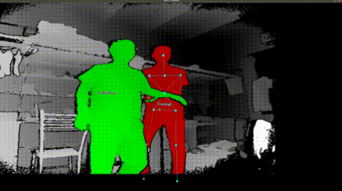

# 行人检测+重识别+跟踪 笔记

[TOC]

## 前言

本项目需要机器人能在视野中对行人进行目标识别，记忆主人的样子，跟随主人的移动，主人在视野中消失后能够报警，并且在主人重新出现后继续跟随。

分析可知，共有三个重要的功能模块要做：行人目标检测、行人重识别、目标跟踪。

也许会有这样一个疑问：目标检测+重识别不是已经能够将行人在视野中的位置确定下来了吗？为何还要加上目标跟踪这一个模块？

答案是：用目标检测+重识别进行跟踪实在是太慢了，帧率可能不能超过10FPS，不能保证实时性。所以需要用一个实时性足够高的算法来进行跟踪，跟丢之后，再进行目标检测+重识别重新锁定目标。

## 行人检测

#### HOG+SVM

行人检测比较传统的方法是HOG+SVM的方法，Opencv里有自带函数和训练好的权重，也可以自己训练模型，两种方法我都尝试过，效果其实不是特别好。有两个问题：

1. 精确率和召回率都不高。（注：精确率：预测为正的样本中有多少是真正的正样本；召回率：样本中的正例有多少被正确预测了）
2. 实时性比较低。我测试720p的图片居然需要耗时1s多，不知道是什么问题。

#### Kinect自带骨架提取

我们在测试时偶然发现kinect自带的骨架提取对人体的检测很准确，并且显示的画面也流畅无比。

考虑到前面还要用骨架提取+手势识别，于是决定干脆人体识别也一并用kinect识别，简化系统。

虽说如此，我还是尝试了一下别的方法。

#### YOLOv3

YOLOv3是一个比较经典的目标识别网络，之前用的也比较多。他在1、2基础上调整了网络结构，利用多尺度特征进行对象检测，在保持速度优势的前提下，提升了预测精度，尤其是加强了对小物体的识别能力。

我之前帮人做过一个用YOLOv3识别监控摄像头里的人的项目，因为YOLO比较适合检测中小型的目标，数据集是COCO这种包含大量行人的数据集。

代码参考了：https://github.com/ultralytics/yolov3

## 行人重识别

重识别用的是浙大罗浩教授的Bag of Tricks and A Strong ReID Baseline，论文是发在2019年CVPR上，方法还比较新。

论文地址：https://arxiv.org/pdf/1906.08332.pdf

开源代码：https://github.com/michuanhaohao/reid-strong-baseline

相关文章：https://zhuanlan.zhihu.com/p/61831669

罗浩教授主要做的事就是统一了一个强力的REID baseline。所谓baseline，就是基准线，某个领域的研究基本都是在一个baseline上展开，增加或修改某些组件，提出改进，得到更好的效果。

REID标准的baseline，是使用resnet50来作为backbone，一个mini-batch包含了P个人的各K张图片，图片经过Backbone之后得到global feature，然后这个特征分别计算一个分类损失（ID loss）和一个triplet loss（batch hard mining）。

罗教授提出的这个baseline，在Market1501可以达到94.5%的Rank1和85.9%的mAP，一甩众多REID baseline的性能，可谓是为后来的REID研究开拓了道路。

补充几个名词的解释：

rank1：搜索结果中最靠前的一张图是正确结果的概率，一般通过多次实验来取平均值。

mAP：mean average precision，平均检索精度。mAP和rank1均是衡量算法搜索能力的指标。

tricks：训练网络时会用到的一些技巧，用于提升训练速度、调整模型结构、训练过程等。作者在论文中也提供了一些训练REID的tricks。

global feature：基于整张图像提取的特征，常见的有颜色直方图、形状描述子、GIST等。

local feature：基于局部图像块的特征，常见的有SIFT、LBP等。

最终的baseline结构图如下：

这是我结合人体识别+行人重识别测试的效果：

检测和识别都非常准确，大概能达到10FPS作用。

## 目标跟踪

目标跟踪大致有3种方法：稀疏表示（sparse representation），相关滤波（correlation filter）和深度学习（CNN-Based）。具体可以参考文章：https://blog.csdn.net/weixin_36836622/article/details/85644377

本次选用的KCF就是在相关滤波的方法。

相关滤波源于信号处理领域，相关性表示两个信号之间的相似程度，通常用卷积表示相关操作。基于相关滤波的跟踪方法基本思想就是，寻找一个滤波模板，让下一帧的图像与我们滤波模板做卷积操作，响应最大的区域就是预测的目标。KCF使用循环矩阵计算，跟踪速度惊人。

经过我的测试，KCF效果非常好，跟踪准确，并且速度很快。在KCFTracker::update(cv::Mat image)函数中有参数peak_value，及卷积响应的峰值，该值小于一定阈值时候可以判断目标跟丢。跟丢时再进行目标检测+行人重识别重新框选目标即可。

作者的个人主页 http://www.robots.ox.ac.uk/~joao/circulant/

目标跟踪算法——KCF入门详解https://blog.csdn.net/crazyice521/article/details/53525366

目标跟踪算法----KCF进阶https://blog.csdn.net/crazyice521/article/details/63685840?utm_medium=distribute.pc_relevant_t0.none-task-blog-BlogCommendFromMachineLearnPai2-1.add_param_isCf&depth_1-utm_source=distribute.pc_relevant_t0.none-task-blog-BlogCommendFromMachineLearnPai2-1.add_param_isCf

跟踪算法KCF原理及代码解析https://blog.csdn.net/qq_17783559/article/details/82629359